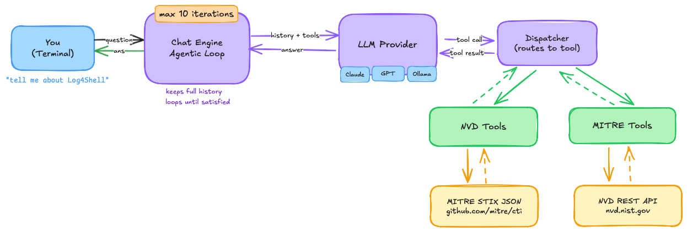

# Vuln Chatbot

- A CLI-based agentic chatbot for querying vulnerability databases using natural language. 
- Ask questions about CVEs, MITRE ATT&CK techniques, and attack patterns, the agent autonomously decides which tools to call, chains multiple queries when needed, and synthesizes a comprehensive answer.


## Architecture

<p align="center">
  
</p>

## User Flow

1. **Input** — User enters a natural language question.
2. **Routing** — The `ChatEngine` appends the message to conversation history and calls the LLM with the available tool schemas.
3. **Tool selection** — The LLM autonomously decides which tools to invoke (e.g. `get_cve_details`, `search_mitre_by_keyword`) based on the query intent.
4. **Data fetch** — Tools query the NVD REST API or read from the local MITRE ATT&CK cache and return structured results.
5. **Chaining** — If more context is needed, the LLM issues additional tool calls in the same turn before composing a final answer.
6. **Response** — The synthesized answer is formatted and printed to the terminal. Conversation history is preserved for follow-up questions.

## Setup

### Pre-requisites

- Python 3.11 or higher
- [uv](https://docs.astral.sh/uv/) — `pip install uv`
- An API key for at least one LLM provider (or Ollama running locally)

### Installation

```bash
# 1. Clone the repo
git clone https://github.com/piyushhagarwal/vulnbot.git
cd vulnbot

# 2. Install dependencies
uv sync

# 3. Configure environment
cp .env.example .env
```

Edit `.env` and set your credentials:

```env
# Choose your LLM provider
LLM_PROVIDER=openai        # or: ollama

# Set the key for whichever provider you chose
OPENAI_API_KEY=sk-...

# NVD API key — optional but recommended
# Without it: 5 requests/30s  |  With it: 50 requests/30s
# Get one free: https://nvd.nist.gov/developers/request-an-api-key
NVD_API_KEY=
```

### Running

```bash
uv run python main.py
```

---

## LLM Providers

| Provider | Setup | Notes |
|---|---|---|
| **OpenAI** | Set `OPENAI_API_KEY` | GPT-5.2 by default |
| **Ollama** | Run `ollama serve` + `ollama pull llama3.1` | Free, fully local, no API key |

Switch providers by changing `LLM_PROVIDER` in `.env` — no code changes needed.

### Ollama Setup

```bash
# Install Ollama: https://ollama.com
ollama serve
ollama pull llama3.1   # must support tool calling
```

Then set in `.env`:
```env
LLM_PROVIDER=ollama
OLLAMA_MODEL=llama3.1
OLLAMA_BASE_URL=http://localhost:11434/v1
```

---

## Available Tools

| Tool | Data Source | When the LLM uses it |
|---|---|---|
| `get_cve_details` | NVD | User provides a specific CVE ID |
| `search_cves_by_keyword` | NVD | User asks about a product or technology |
| `search_cves_by_severity` | NVD | User asks for critical/high/medium/low CVEs |
| `search_cves_by_date_range` | NVD | User asks about recent or date-specific CVEs |
| `get_mitre_technique` | MITRE ATT&CK | User provides a T-ID (e.g. T1059) |
| `search_mitre_by_keyword` | MITRE ATT&CK | User asks about attack patterns or tactics |

### Example Queries

```
# CVE lookups
- show me details for CVE-2021-44228
- what is the severity of CVE-2024-1234
- is CVE-2023-44487 in the CISA KEV catalog?

# Keyword search
- find vulnerabilities related to Apache Log4j
- what are the latest critical vulnerabilities in nginx?
- show me recent CVEs from the last 30 days

# MITRE ATT&CK
- what are the attack patterns for T1059?
- tell me about T1190 and how to detect it
- what techniques are used for lateral movement?

# Multi-source (agent chains tools automatically)
- tell me about Log4Shell and its related attack techniques
- what MITRE techniques relate to the Apache vulnerabilities found this year?
```

---

## MITRE ATT&CK Data

On first run, the chatbot downloads the MITRE ATT&CK enterprise STIX bundle (~10MB) from GitHub and caches it to `.mitre_cache.json`. Subsequent runs load from cache instantly.

To force a refresh:

```python
from src.clients.mitre_client import MITREClient
MITREClient().refresh()
```

Or simply delete `.mitre_cache.json` and restart.
---

## CLI Commands

| Input | Action |
|---|---|
| Any natural language query | Runs the agentic loop |
| `clear` | Resets conversation history |
| `exit` or `quit` | Exits the chatbot |
| `Ctrl+C` | Cancels current response, re-prompts |
| `Ctrl+D` | Exits the chatbot |

---

## Rate Limits

**NVD API:**
- Without API key: 5 requests per 30 seconds
- With API key: 50 requests per 30 seconds
- The client automatically sleeps between requests to stay within limits
- A free API key is recommended: https://nvd.nist.gov/developers/request-an-api-key

**MITRE ATT&CK:**
- No rate limits — data is loaded from a local cache file

---

## Security Notes

- **Prompt injection** — All data returned from NVD and MITRE is wrapped with explicit markers before being fed to the LLM, instructing it to treat the content as data only, not instructions. User queries are also sanitized to prevent injection attempts.
- **No exploit code** — The system prompt explicitly instructs the LLM not to provide exploit code or detailed attack instructions.
- **API keys** — stored in `.env` which is gitignored. Never commit your `.env` file.